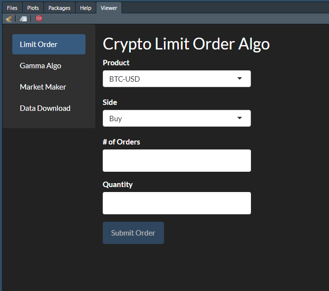

<p align="center">
  
</p>

# CoinbasePro Execution Dashboard

  This is a dashboard written in R, using the Shiny interface to execute common tasks needed for execution and data management
of crypto currency markets on the CoinbasePro exchange.  While there is plenty of excellent backtesting, and charting programs available,
I haven't come across any algorithmic execution tools that can be overlayed onto existing strategies and incorporate data science centric design, so I decided to build something that could be useful for anyone looking to gain an edge on their execution.  This was built on a windows 10 computer, but have used this on a mac in the past.  Instructions are based on a Windows 10 installation. This dashboard has no affiliation with Coinbase Pro and is an independant project with no warranties. Please use at your own risk. 


## Getting Started

Programs to download:
- You can download the latest R [here](https://cran.r-project.org/bin/windows/base/)
- You can download RStudio [here](https://rstudio.com/products/rstudio/download/)
- SQLite Data browser [here](https://sqlitebrowser.org/dl/)
- Signup for Pusbullet [here](https://www.pushbullet.com/) and get the phone app and/or browser extension to be notified of trades

Installation instructions:
1. Clone repository and install unzipped folder with Documents (or where you like)
2. Rename the _input file and the database (data/coinbase_0.1) to exclude the phrase "_sample"
3. Open the _input.R file and update the API keys for Coinbase Pro and also PushBullet
4. Install rgdax package using the following code in R console of Rstudio 
```
install.packages('devtools')
library(devtools)
install_github("Guceri/rgdax", ref = "dev")
```
5. Launch app.R file in Rstudio and run app

If there are any issues, please let me know.  The instructions are not exhaustive and not meant for complete beginners. 

## TODO
  Ideally, the vision is to turn this into a suite of tools that can be used for strategy development and easy plug n play with other programs that may have functionality that doesn't need to be rebuilt.  Bridging the gap between programs and leveraging R's data science capabilities is the general idea. Please feel free to provide feedback and thoughts on what you think could be useful.

- [X] Finish README.md with installation instructions and overview
- [ ] Optionality for csv file creation or not on historical download
- [X] Max price input for gamma algo
- [X] Stop/Restart gamma algo does not print "gamma algo has started"
- [ ] Immediate limit order fills print "something went wrong"
- [X] "Market" orders on gamma algo need to be more robust because buying power is slow to update on coinbases api
- [x] Create option on limit order to trade out of full position or buy full position


## Vision
  The idea will ulitmately be to make this dashboard low(ish) latency and to incorporate more data science features. Currently the need for these items are not priority at the moment and will likely come at a later time.
  
- [ ] Incorporate websocket for market maker
- [ ] Work on incorporating a "strategy" file to incoporate addtional functionality for automated trading (ie. technical analysis)
- [ ] Work on incorporating Machine Learning Techniques to develop strategy ideas
  
## Flow Chart
Below is a flow chart of the current set up.  This is likely to change over time and I will try and update it as I go along, but this should give a general structure to how things are set up. 


## Dashboard
The dashboard should look like the below image.  It can be viewed in the Viewer pane of R Studio or an be a seperate window based on your settings.



## [Limit Order Algo](_limitorderalgo.R)
  The limit order algo allows you to be best bid/offer by updating your limit price anytime the market moves away from your current limit price.  Large orders can be broken down into smaller "slices" so that your resting order is not so large that it would look obvious.  In future installations, I will include a randomizer to the slices so that they are not constantly the same size. 
  
| Command | Description |
| --- | --- |
| Product | List of tradeable products |
| Side | Direction of trade |
| # of Orders | Total # of orders you would like to send |
| Quantity | The size of each order |
  
## [Gamma Order Algo](_gamma_algos.R)
  Since CoinbasePro has included the ability to leverage BTC trading, I created a "Gamma" algo which keeps track of your buying power and buys additional BTC as price moves up and buying power is made available.  This allows to have a convex potential exposure to BTC which is similar to the effects of Gamma in an options position. Please note that market orders are actually just limit orders with a max slippage input. Future installations will create more functionality for limiting how this is used and providing more flexibility for dealing with margin calls and potential exit targets. 
  
| Command | Description |
| --- | --- |
| Product | List of tradeable products |
| Order Type | Specify order type |
| $ buffer | Amount subtracted from true buying power |
| Min. Buying Power | Total Buying Power needed to trigger a trade |
| Max Market Order Slippage | Max slippage allowed on "market" orders |
| Max Price | Price at which algo stops buying |

## [Market Maker Algo](_automation.R)
  This is an algo that allows you to quote two sided markets at specified widths along with various built in bias which look at the order book as well as current available position/funds.  This is NOT a low latency market maker and is not recommended on liquid pairs that are commonly arbitraged among exchanges (ie. BTC, ETH, LTC) with low latency design structures.  When coinbase pro was GDAX, limit orders were free, and there was an appeal to trade limit orders to catch sloppy market orders.  This has since changed.  This may still be useful on less liquid alt's however.  A low latency design will be looked at for further development if time permits.  Once a position gets close to specified position limits, a bias can be introduced on sizing. If position limits are breached, then the algo will reduce or increase position using the limit order algo to readjust core position to within the min/max limits.  See code for details.
  
| Command | Description |
| --- | --- |
| Market | List of tradeable products |
| Order Size | Size of orders |
| Order Sizing Bias | Bias of sizing of orders |
| Automatice Bias | Will automatically create bias as position approaches min/max levels
| Min Position | Smallest core position before limit order algo increases position |
| Max Position | Largest core position before limit order algo reduced position |

## [Data Download](_coinbase_hist.R)
  Since CoinbasePro only allows you to download limited amount of historical data per request, a sqlite database was created to be able to store all historical data (1 min granularity), as well as the production of a CSV file which can be used for other software programs (such as a backtesting software).  This first download will take a little time, but then updating the database afterwards shoudl be quick.
